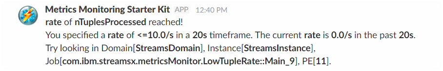

## [](#header-1)What's New?

*   **[Get Started with the Slack Toolkit in IBMStreams](https://developer.ibm.com/streamsdev/2017/06/30/get-started-slack-toolkit-ibmstreams/)**
*   **[SPLDoc for the Slack toolkit](https://ibmstreams.github.io/streamsx.slack/doc/spldoc/html/index.html)**

## [](#header-2)Prerequisites

1.  **IBM Streams** -- If you don't have this installed, you can try it by downloading the [Quick Start Edition](http://ibm.co/streamsqs).
1.  **streamsx.slack** -- Download the toolkit, either by cloning it from the official [repository](https://github.com/IBMStreams/streamsx.slack) or using the download links above. See _Setup Instructions_ below.
1.  **An incoming webhook URL** for your Slack channel — You can generate one [here](https://slack.com/apps/A0F7XDUAZ-incoming-webhooks) (you may need to ask your team admin for permission to add a webhook).

## [](#header-3)Setup Instructions

1. Clone and build the streamsx.slack toolkit by running the following commands:
	```bash
	git clone https://github.com/IBMStreams/streamsx.slack.git
	cd streamsx.slack/com.ibm.streamsx.slack
	ant all
	```
2.  Add the toolkit as a dependency to your Streams application.

_Note: If you don’t have a Streams application to test with, there are 3 samples in the toolkit’s `samples` folder you may reference._

## [](#header-4)Configuration

| Parameter               | Type            | Description      |
|:---------------------   |:--------------- |:---------------- |
| **slackConfiguration**  | _rstring_       | Specifies name of the Streams application configuration containing the Slack incoming WebHook URL to send messages to. |
| **slackUrl**            | _rstring_       | Specifies the Slack incoming WebHook URL to send messages to. |

## [](#header-5)Sample Message


## [](#header-6)Other Links

*   [IBM Streams on Github](http://ibmstreams.github.io)
*   [Introduction to Streams Quick Start Edition](http://ibmstreams.github.io/streamsx.documentation/docs/4.2/qse-intro/)
*   [Streams Getting Started Guide](http://ibmstreams.github.io/streamsx.documentation/docs/4.2/qse-getting-started/)
*   [StreamsDev](https://developer.ibm.com/streamsdev/)
